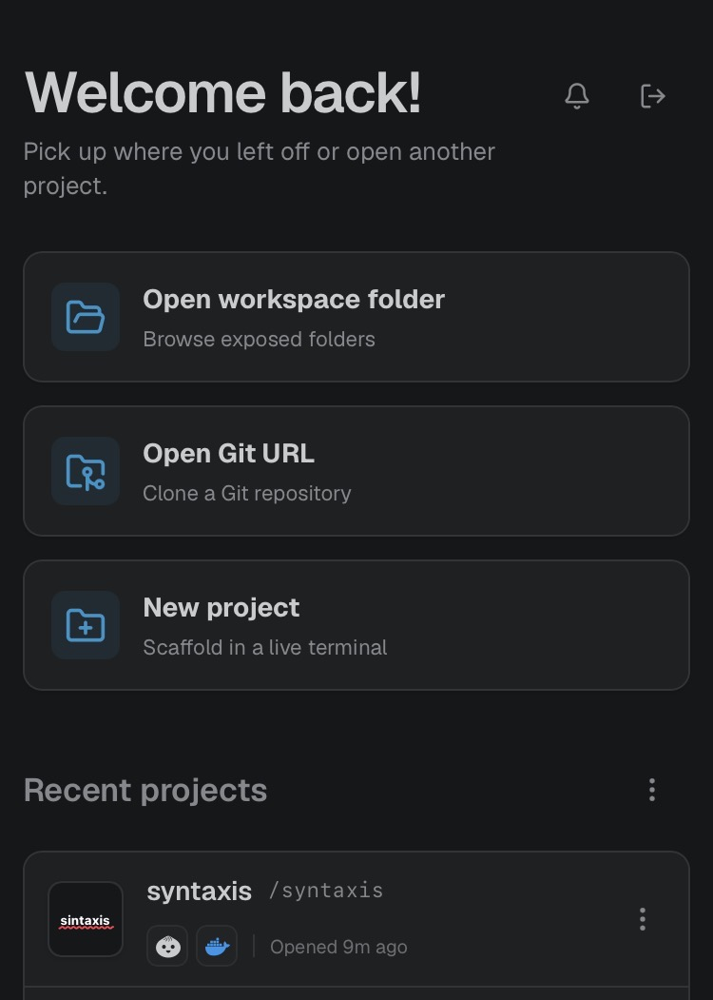
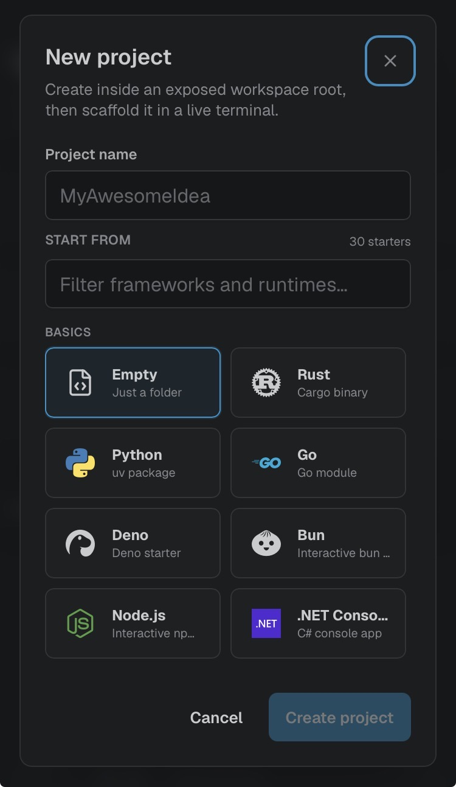
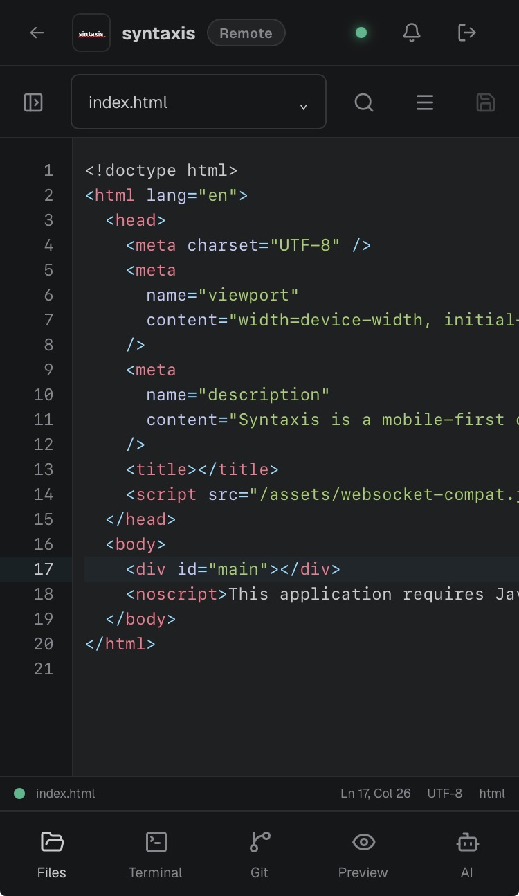
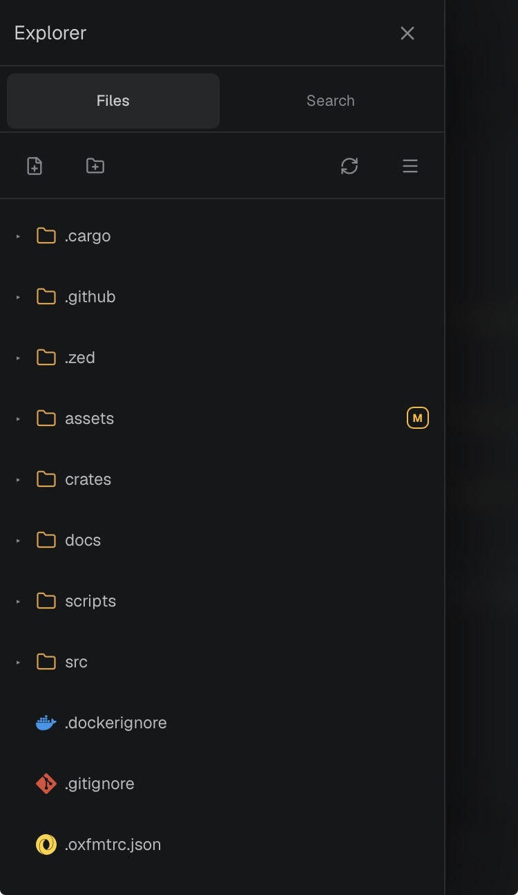
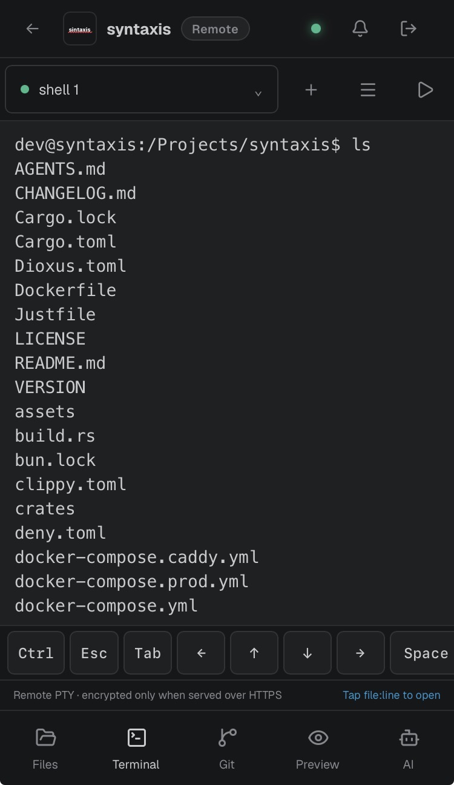
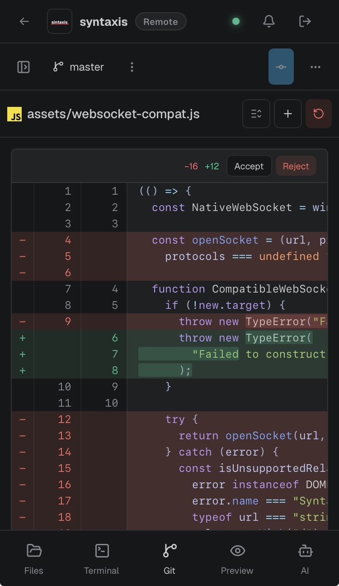
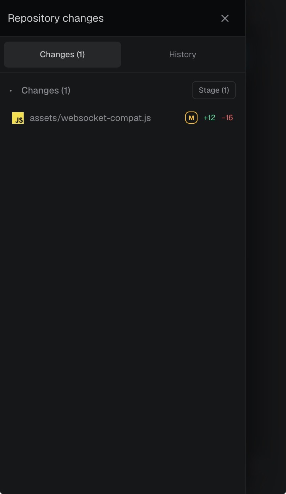
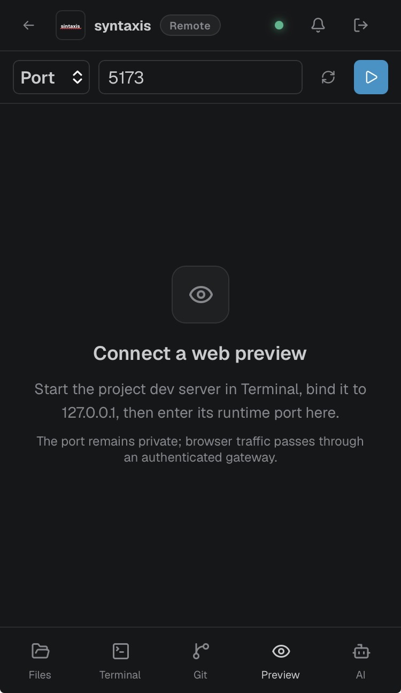
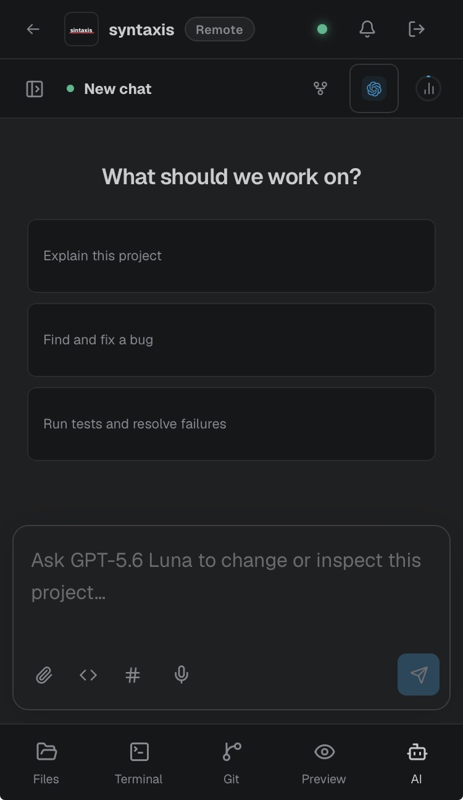
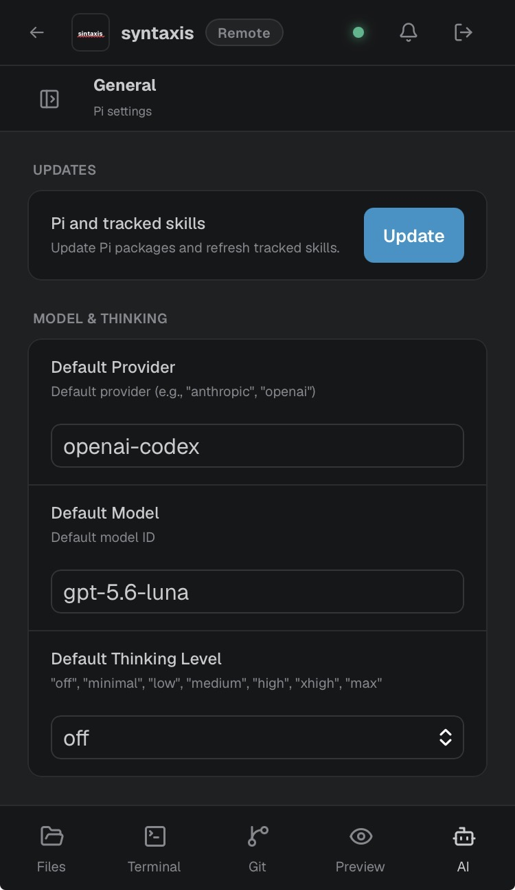

# Syntaxis

**A mobile-first, self-hosted development workspace for projects on your server.**

Syntaxis gives you a code editor, terminals, Git, and application previews in one browser interface
that is designed to work on a phone. Install it on a VPS, home server, or development machine and
open the same projects from mobile, tablet, or desktop.

Your code stays in ordinary folders on your machine. Syntaxis does not provide compute, copy your
repositories into a hosted workspace, or replace your existing command-line tools.

## Is this for you?

Syntaxis is for developers who:

- keep projects on an always-on Linux machine;
- want more than an SSH terminal from their phone;
- find desktop IDEs awkward in a mobile browser;
- want to keep their own filesystem, tools, credentials, and server;
- are comfortable managing Docker, HTTPS, and backups.

It is not a good fit if you need:

- the full extension, debugging, and refactoring support of a desktop IDE;
- a general SSH client for many unrelated servers;
- hosted compute with no server administration;
- multiple users, roles, isolated workspaces, quotas, or audit logs;
- a safe environment for running untrusted projects.

## What it includes

### Projects

<table>
<tr>
<td></td>
<td></td>
</tr>
</table>

Open an existing server folder, clone a Git repository, or scaffold a new project in a live terminal.
Projects remain normal directories and continue to work outside Syntaxis.

### Files and editor

<table>
<tr>
<td></td>
<td></td>
</tr>
</table>

Browse and search the project, open multiple files, find and replace text, view images, inspect diffs,
and edit with syntax highlighting.

Optional language-server support adds diagnostics and semantic completions for Rust, JavaScript,
TypeScript, Deno, Python, Go, HTML, CSS, JSON, YAML, TOML, shell, Terraform, PHP, Ruby, Vue, Svelte,
Astro, and Tailwind projects.

Syntaxis uses [Mise](https://mise.jdx.dev/) to find and run development tools. For projects without a
Mise configuration, it can infer a starting toolchain and language-server setup.

### Terminal

<table>
<tr>
<td></td>
</tr>
</table>

Create and reconnect to real shell sessions running on the server. The terminal includes touch
scrolling, mobile control keys, and links from recognized source locations back to the editor.

Sessions belong to the server rather than the current browser page, so changing sections does not
close them.

### Git

<table>
<tr>
<td></td>
<td></td>
</tr>
</table>

Review staged and unstaged diffs, stage or discard files, commit, manage branches and tags, inspect
history, work with remotes, pull, push, and handle common merge workflows.

The supplied container can use SSH and GnuPG configuration deliberately mounted from the host.

### Preview

<table>
<tr>
<td></td>
</tr>
</table>

Start an HTTP development server from Terminal and open it through Syntaxis. On Linux, Syntaxis can
detect listening processes associated with the current project.

The preview gateway supports HTTP and WebSockets, so common hot-reload setups continue to work.
Previews are private by default and can optionally receive a separate revocable share link.

### Coding agent

<table>
<tr>
<td></td>
<td></td>
</tr>
</table>

Syntaxis includes an interface for the [Pi coding agent](https://pi.dev/). It uses Pi's
native RPC mode and Pi's existing provider configuration, sessions, prompts, skills, and extensions.
None of the editor, terminal, Git, project, or preview features require it.

## How it runs

```text
phone, tablet, or desktop browser
                |
              HTTPS
                |
         Syntaxis server
          /      |      \
    projects   tools   terminals
```

The supported production deployment is a container on Linux. Project directories are mounted into
the container, and a persistent home stores installed tools and Pi data.

Syntaxis performs file operations and starts terminals, Git, language servers, project commands, and
other tools with the runtime user's permissions. It is not an SSH gateway or a security boundary
between projects.

Syntaxis is currently single-user. Anyone who can log in effectively has development-shell access to
the runtime. Read the [security model](docs/security.md) before exposing it to a network.

## Get started

You need:

- a Linux machine with Docker Compose;
- a domain served through HTTPS;
- a directory of projects the container may read and write.

Follow the [getting started guide](docs/getting-started.md) to configure the password, project mount,
reverse proxy, and first workspace.

The production image is published at:

```text
ghcr.io/katawaredev/syntaxis
```

## Documentation

- [Getting started](docs/getting-started.md)
- [Features and limitations](docs/features.md)
- [Deployment](docs/deployment.md)
- [Security model](docs/security.md)
- [Pi integration](docs/pi-management.md)
- [Development and maintenance](docs/development.md)
- [Changelog](CHANGELOG.md)
